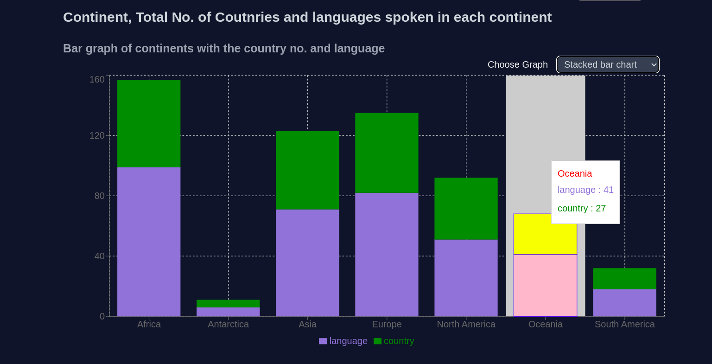

## Project Details

### Tech Stack used:

- Next JS
- Tailwind CSS
- Recharts

### Project structure

- Next JS App router

Project link

- The projec is hosted on vercel
- link: https://bceps-chart-ee6q.vercel.app/

screenshot of the project

- List of all countries
  

- Multi bar graph
  
  
  

- Pie chart on the basis of contries number and language spen in each continent
  
  

Other images:

